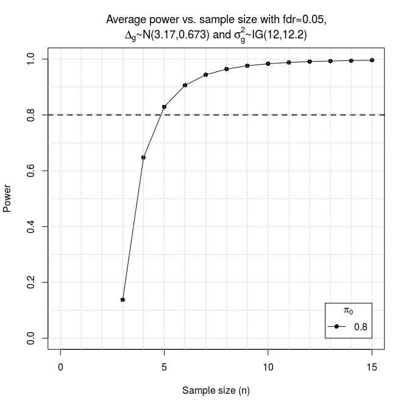

# ssizeRNA
Sample Size Calculation for RNA-Seq Data using the limma/voom modeling assumptions

```R
library(edgeR)
library(Biobase)

## load hammer dataset (Hammer, P. et al., 2010)
data(hammer.eset)
trt <- hammer.eset$protocol[ which(hammer.eset$Time == "2 weeks") ] 
counts <- exprs(hammer.eset)[, which(hammer.eset$Time == "2 weeks")]
counts <- counts[which(rowSums(counts) > 0), ]
geom.mean = function(row){
  row[row == 0] = 0.1
  if(length(row) != 0) return(exp(sum(log(row))/length(row)))
  else return(0)
}

mu <- apply(counts, 1, geom.mean)        ## geometric mean for each gene
d <- DGEList(counts)
d <- calcNormFactors(d)
d <- estimateCommonDisp(d)
d <- estimateTagwiseDisp(d)
disp <- d$tagwise.dispersion             ## dispersion for each gene

size <- ssizeRNA_vary(pi0=0.8, mu=mu, disp=disp, logfc=1, m=30, maxN=15, replace=F)
```
